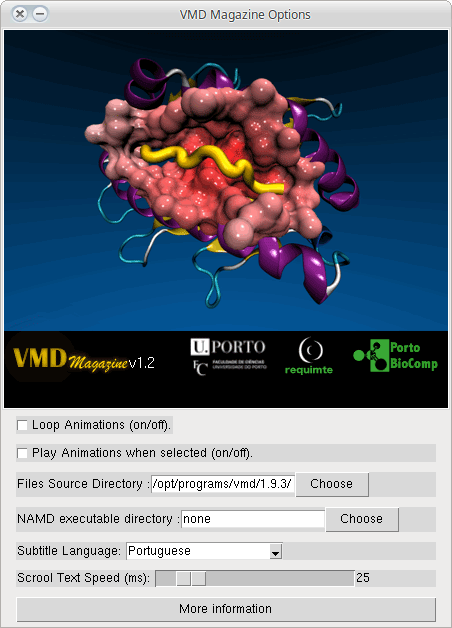
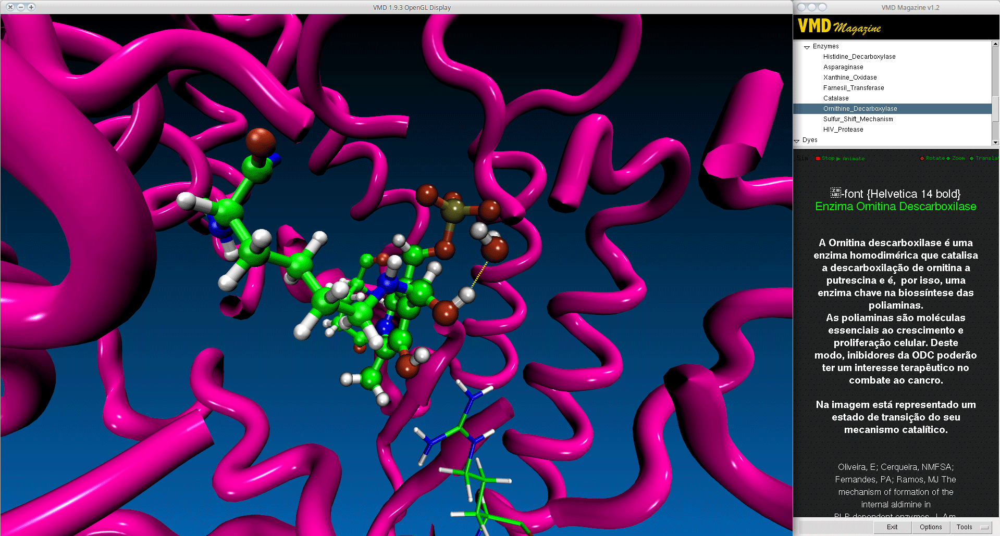
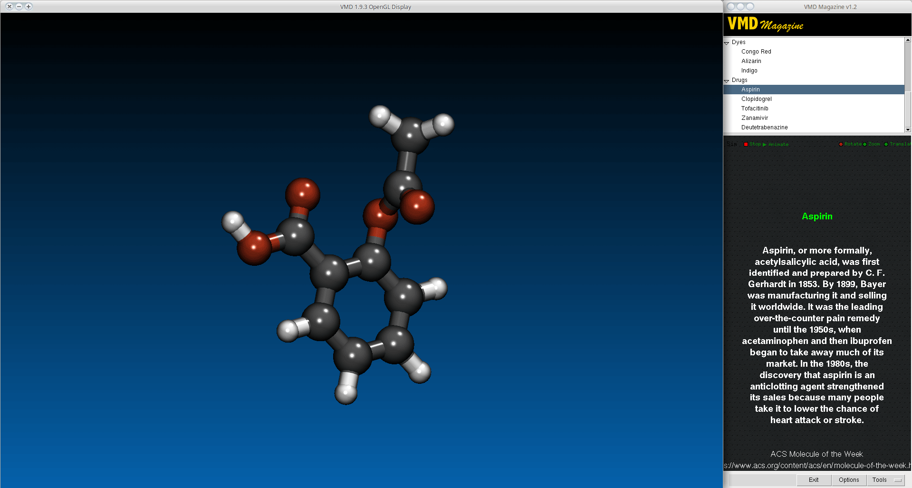
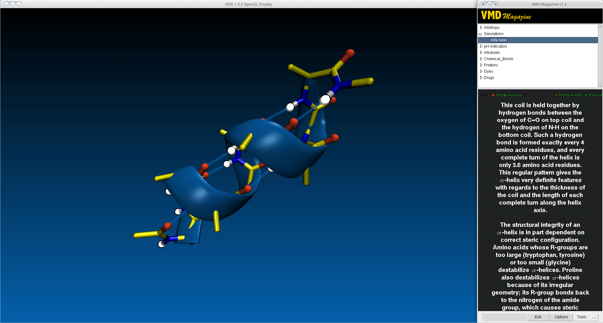
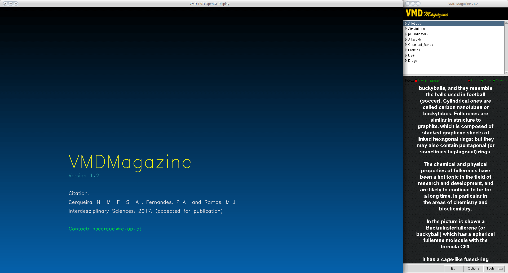

# Introduction
Visualization can be a motivating way of teaching students about the microscopic world. This can become even more exciting if the information is based on accurate computational results rather than on crude approximations that eventually might create unreal alternative perceptions. Here, we report on a VMD plug-in – VMDMagazine, which can play and handle computational simulations into stunning high-impact video presentations, suitable for classes/lectures and even conferences. The software will help students/audience to understand atoms and molecules better and learn to like them.

VMDMagazine was developed with the goal of visualizing scientific information without requiring any prior knowledge of the user in the area of molecular visualization or even molecular modeling. This means that the users (teachers and students) do not have to worry about the handling of molecular visualization software or in the preparation of such types of visualizations that normally involve complex selection steps and the upload of multiple files and scripts.

All the images/Movies handled by VMDMagazine can be easily built under the VMD environment and it only requires the upload of a structure, the modification of the atoms representation and save the vmd session and associated files into a custom directory. Later, the user can add a subtitle to the image/movie by the creation of a simple txt file in the same directory. All these procedures are very simple and almost every one should be capable of doing them, even those ones that have less experience with the VMD interface.

## Minimum Requirements
Operating System: macOS, Linux or Windows
Visual Molecular Dynamics (VMD) 1.9.1 or later

## Installation

You could install vmdMagazine through [vmdStore](https://github.com/BioSIM-Research-Group/vmdStore) (Recommended).

## Contacts
If you have any suggestion of new features, please contact us: nscerque@fc.up.pt

## Citation
Cerqueira, N.M., Fernandes, P.A., & Ramos, M.J. (2017). Visualizing the Microscopic World. Interdisciplinary Sciences: Computational Life Sciences, 1-6.

## DOI
http://doi.org/10.1007/s12539-017-0255-2
